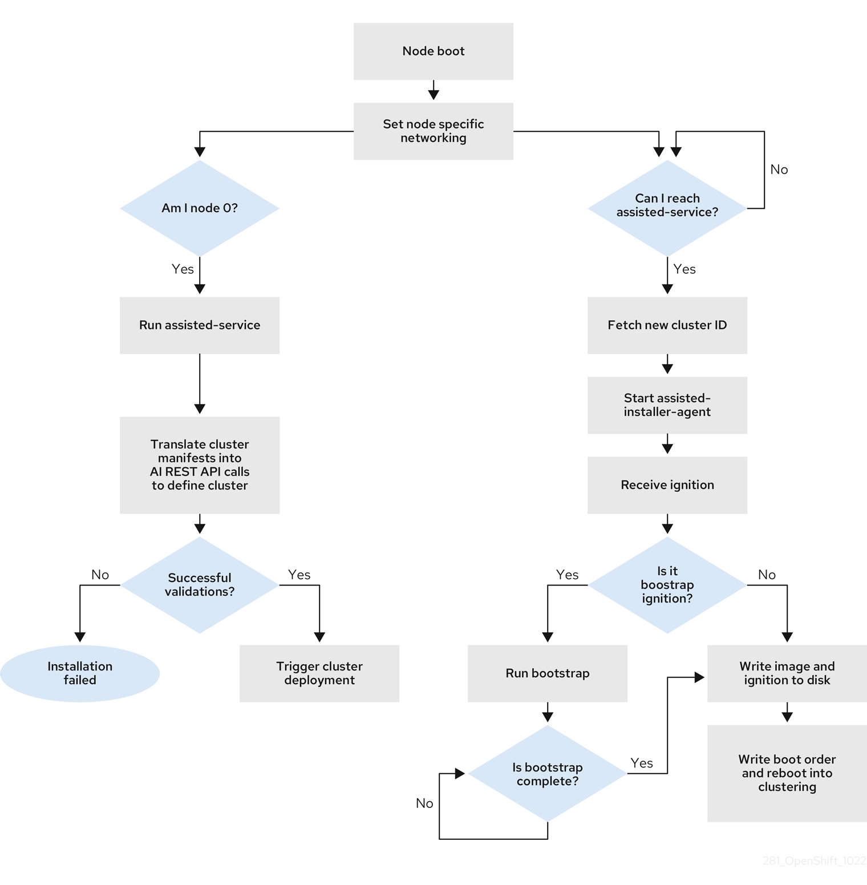

# Installing OpenShift using the Agent-Based Installer

⚠️ WIP

The Agent-based installation comprises a bootable ISO that contains the Assisted discovery agent and the Assisted Service. Both are required to perform the cluster installation, but the latter runs on only one of the hosts.

The openshift-install agent create image subcommand generates an ephemeral ISO based on the inputs that you provide. You can choose to provide inputs through the following manifests:

Preferred:

`install-config.yaml`

`agent-config.yaml`

Optional: ZTP manifests

`cluster-manifests/cluster-deployment.yaml`

`cluster-manifests/agent-cluster-install.yaml`

`cluster-manifests/pull-secret.yaml`

`cluster-manifests/infraenv.yaml`

`cluster-manifests/cluster-image-set.yaml`

`cluster-manifests/nmstateconfig.yaml`

`mirror/registries.conf`

`mirror/ca-bundle.crt`

One of the control plane hosts runs the Assisted Service at the start of the boot process and eventually becomes the bootstrap host. This node is called the rendezvous host (node 0). The Assisted Service ensures that all the hosts meet the requirements and triggers an OpenShift Container Platform cluster deployment. All the nodes have the Red Hat Enterprise Linux CoreOS (RHCOS) image written to the disk. The non-bootstrap nodes reboot and initiate a cluster deployment. Once the nodes are rebooted, the rendezvous host reboots and joins the cluster. The bootstrapping is complete and the cluster is deployed.



[Official Documentation - OCP Installation using the Agent-Based Installer](https://docs.redhat.com/en/documentation/openshift_container_platform/4.17/html/installing_an_on-premise_cluster_with_the_agent-based_installer/preparing-to-install-with-agent-based-installer#agent-based-installer-recommended-resources_preparing-to-install-with-agent-based-installer)

> In the install-config.yaml, specify the platform on which to perform the installation. The following platforms are supported:
>
> * `baremetal`
> * `vsphere`
> * `none`

> Important
> For platform none:
>
> The none option requires the provision of DNS name resolution and load balancing infrastructure in your cluster. See Requirements for a cluster using the platform "none" option in the "Additional resources" section for more information.
Review the information in the guidelines for deploying OpenShift Container Platform on non-tested platforms before you attempt to install an OpenShift Container Platform cluster in virtualized or cloud environments.

## Preperations

Setup a Bastion Host using e.g RHEL9.

On the bastion host, download the cli's:

`curl -LO <url>`

- [openshift-install-rhel9](https://mirror.openshift.com/pub/openshift-v4/clients/ocp/4.17.6/openshift-install-rhel9-amd64.tar.gz)
- [openshift-client-linux-amd64](https://mirror.openshift.com/pub/openshift-v4/clients/ocp/4.17.6/openshift-client-linux-amd64-rhel9-4.17.6.tar.gz)

Unpack the `.gz`files and copy them into your path:

If /usr/local/bin isn't included in the $PATH, run
`export PATH=/usr/local/bin:$PATH`

```shell
cp openshift-install /usr/local/bin/
cp oc /usr/local/bin/
cp kubectl /usr/local/bin/
```

## Validation via RHEL Live iso

In order to get the nic interface names of your servers, it could be helpful to quickly run a live-iso RHEL.

`curl -LO https://mirror.openshift.com/pub/openshift-v4/dependencies/rhcos/4.17/latest/rhcos-4.17.2-x86_64-live.x86_64.iso`

## Bastion Host Preperation

`cat ~/.ssh/id_ed25519.pub | ssh rguske@rguske-bastion.rguske.coe.muc.redhat.com "mkdir -p ~/.ssh && cat >> ~/.ssh/authorized_keys && chmod 600 ~/.ssh/authorized_keys && chmod 700 ~/.ssh"`

`sudo subscription-manager register --username  --password `

## Cluster Preperations

* created 3 Control-Plane nodes
* created 2 Worker-Nodes

**IMPORTANT** configure the Advanced Parameters `disk.EnableUUID = True` when VMs got created manually on vSphere.

It'll be a HA OCP cluster. Three types of clusters are supported:

* Single-Node cluster (SNO)
* Compact cluster (three nodes - master and worker in one)
* HA cluster (three cp nodes and three worker nodes)

Collecting the necessary nic information:

| name  | nic | mac | ipv4 | comment |
|---|---|---|---|---|
| ocp1-cp1  | ens33 | 00:50:56:88:0e:0c | 10.32.96.122  | Control Plane Node 1  |
| ocp1-cp2  | ens33 |  00:50:56:88:17:c1 | 10.32.96.123  | Control Plane Node 2  |
| ocp1-cp3  | ens33 | 00:50:56:88:97:e8 | 10.32.96.124  | Control Plane Node 3  |
| ocp1-n1  | ens33 | 00:50:56:88:9b:a4 | 10.32.96.125  | Worker Node 1  |
| ocp1-n2  | ens33 | 00:50:56:88:fe:2e | 10.32.96.126  | Worker Node 2  |

BaseDomain: rguske.coe.muc.redhat.com

## Configurations

`agent-config.yaml`

```yaml
cat > agent-config.yaml << EOF
apiVersion: v1beta1
kind: AgentConfig
metadata:
  name: ocp1
rendezvousIP: 10.32.96.122
hosts:
  - hostname: ocp1-cp1.rguske.coe.muc.redhat.com
    role: master
    interfaces:
      - name: ens33
        macAddress: 00:50:56:88:0e:0c
    networkConfig:
      interfaces:
        - name: ens33
          type: ethernet
          state: up
          mac-address: 00:50:56:88:0e:0c
          ipv4:
            enabled: true
            address:
              - ip: 10.32.96.122
                prefix-length: 20
            dhcp: false
      dns-resolver:
        config:
          server:
            - 10.32.96.1
      routes:
        config:
          - destination: 0.0.0.0/0
            next-hop-address: 10.32.111.254
            next-hop-interface: ens33
            table-id: 254
  - hostname: ocp1-cp2.rguske.coe.muc.redhat.com
    role: master
    interfaces:
      - name: ens33
        macAddress: 00:50:56:88:17:c1
    networkConfig:
      interfaces:
        - name: ens33
          type: ethernet
          state: up
          mac-address: 00:50:56:88:17:c1
          ipv4:
            enabled: true
            address:
              - ip: 10.32.96.123
                prefix-length: 20
            dhcp: false
      dns-resolver:
        config:
          server:
            - 10.32.96.1
      routes:
        config:
          - destination: 0.0.0.0/0
            next-hop-address: 10.32.111.254
            next-hop-interface: ens33
            table-id: 254
  - hostname: ocp1-cp3.rguske.coe.muc.redhat.com
    role: master
    interfaces:
      - name: ens33
        macAddress: 00:50:56:88:97:e8
    networkConfig:
      interfaces:
        - name: ens33
          type: ethernet
          state: up
          mac-address: 00:50:56:88:97:e8
          ipv4:
            enabled: true
            address:
              - ip: 10.32.96.124
                prefix-length: 20
            dhcp: false
      dns-resolver:
        config:
          server:
            - 10.32.96.1
      routes:
        config:
          - destination: 0.0.0.0/0
            next-hop-address: 10.32.111.254
            next-hop-interface: ens33
            table-id: 254
  - hostname: ocp1-n1.rguske.coe.muc.redhat.com
    role: worker
    interfaces:
      - name: ens33
        macAddress: 00:50:56:88:9b:a4
    networkConfig:
      interfaces:
        - name: ens33
          type: ethernet
          state: up
          mac-address: 00:50:56:88:9b:a4
          ipv4:
            enabled: true
            address:
              - ip: 10.32.96.125
                prefix-length: 20
            dhcp: false
      dns-resolver:
        config:
          server:
            - 10.32.96.1
      routes:
        config:
          - destination: 0.0.0.0/0
            next-hop-address: 10.32.111.254
            next-hop-interface: ens33
            table-id: 254
  - hostname: ocp1-n2.rguske.coe.muc.redhat.com
    role: worker
    interfaces:
      - name: ens33
        macAddress: 00:50:56:88:fe:2e
    networkConfig:
      interfaces:
        - name: ens33
          type: ethernet
          state: up
          mac-address: 00:50:56:88:fe:2e
          ipv4:
            enabled: true
            address:
              - ip: 10.32.96.126
                prefix-length: 20
            dhcp: false
      dns-resolver:
        config:
          server:
            - 10.32.96.1
      routes:
        config:
          - destination: 0.0.0.0/0
            next-hop-address: 10.32.111.254
            next-hop-interface: ens33
            table-id: 254
EOF
```

`install-config.yaml`

```yaml
cat > install-config.yaml << EOF
apiVersion: v1
baseDomain: rguske.coe.muc.redhat.com
compute:
- name: worker
  replicas: 2
controlPlane:
  name: master
  replicas: 3
metadata:
  name: ocp1
networking:
  clusterNetwork:
    - cidr: 10.128.0.0/14
      hostPrefix: 23
  machineNetwork:
    - cidr: 10.32.96.0/20
  serviceNetwork:
    - 172.30.0.0/16
  networkType: OVNKubernetes
platform:
  baremetal:
    apiVIPs:
    - 10.32.96.120
    ingressVIPs:
    - 10.32.96.121
fips: false
pullSecret: '{"auths":{"cloud.openshift.com":...'
sshKey: 'ssh-rsa AAAAB3...'
EOF
```

## Create Agent iso

`mkdir conf`

Create the install-config.yaml and agent-install.yaml file.

Run `openshift-install agent create image --dir conf/`

Mount the `agent.x86_64.iso` on the machines (BM or VM).

Boot the machines and wait until the installation is done.

Validate the installer progress using `openshift-install wait-for install-complete --dir conf/`

## Run a `httpd` webserver on the bastion to share the iso

Depending on your environment, providing the created iso can be cumbersome.

One quick and easy way could be by making it downloadable via a webserver.

Install `httpd` on the bastion host.

```bash
dnf install httpd
sudo systemctl enable --now httpd
sudo firewall-cmd --permanent --add-service=http
sudo firewall-cmd --reload
sudo firewall-cmd --list-all
```

Validate the service is running:

```bash
sudo ss -tuln | grep :80
curl -I http://localhost
sudo tail -f /var/log/httpd/error_log
```

Copy the created iso into `/var/www/html/`.

Download the iso by using e.g. `curl -LO http://<bastion-name/ip>/agent.x86_64.iso` or `wget`.

## Connect to OCP

`export KUBECONFIG=auth/kubeconfig`

`oc whoami --show-console`

`cat auth/kubeadmin-password`

`kubectl get nodes`


## Troubleshooting

Remove the Agent cache dir `rm -rf /home/rguske/.cache/agent`

`ssh -l core ocp1-cp1.rguske.coe.muc.redhat.com`